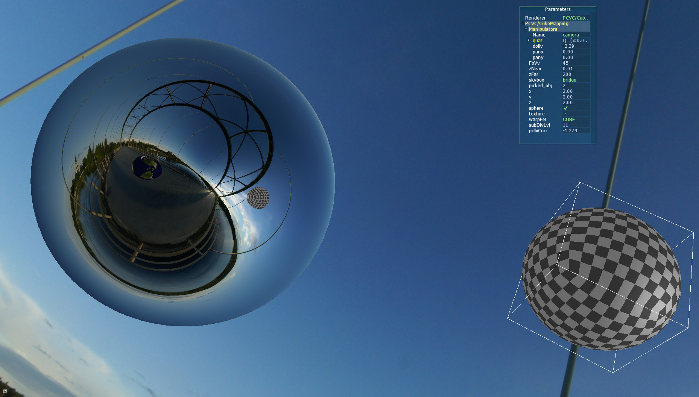
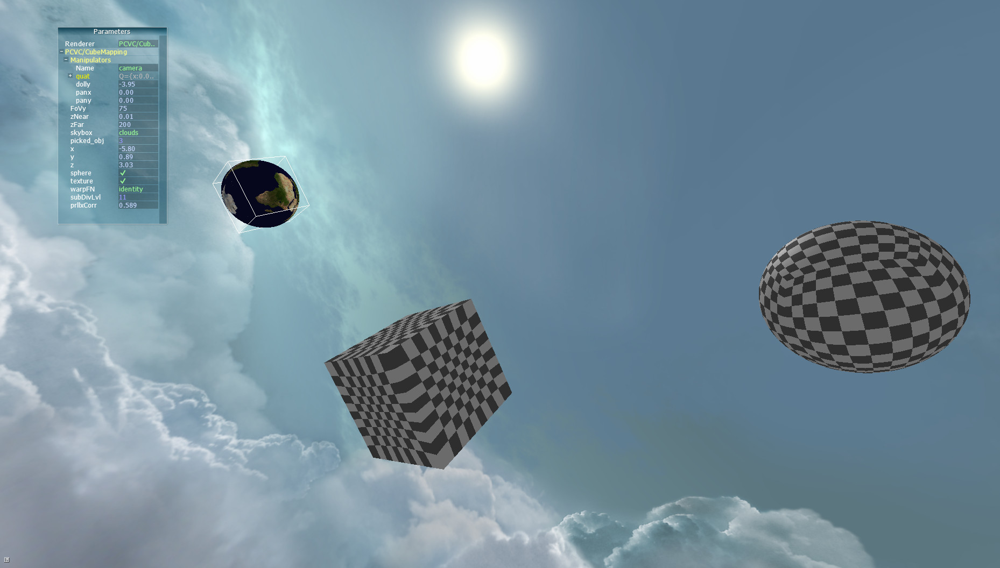

# OGL4Core-CubeMapping
A demo of cube mapping applications in OpenGL realised as a Plugin to the OGL4Core Framework. 

OGL4Core is developed by the [Institute for Visualization & Interactive Systems](https://www.vis.uni-stuttgart.de) of the University of Stuttgart and intended to provide an environment for prototypical or educational OpenGL centric applications.
This plugin revolves around the topic of [cube mapping](https://en.wikipedia.org/wiki/Cube_mapping) and shows an interactive scene populated by 3 movable cubes (or spheres) covered by a skybox.
A cube to sphere projection approach is implemented to switch from cube to sphere which leverages the exploration of texture coordinate warping techniques for area preservation on the surface.
Appart from that, one of the objects can be made reflecting, which is realized using a single pass layered rendering approach.
This in turn utilizes [geometry shader instancing](https://www.khronos.org/opengl/wiki/Geometry_Shader#Instancing), an [array texture](https://www.khronos.org/opengl/wiki/Array_Texture) and [cube map texture](https://www.khronos.org/opengl/wiki/Cubemap_Texture).

## Screenshots

---

## Installation
1. In order to run it you need to download the OGL4Core framework here <https://www.vis.uni-stuttgart.de/projekte/ogl4core-framework>. 
There are versions for differenmt Linux distributions as well as Windows, you need to download a version with sources (src) in order to compile this plugin.
2. Unpack the downloaded archive to a location of your choice.
3. In the root directory of the OGL4Core framework you'll find a directory named `Plugins`. Within that directory, clone this repository. 
E.g. `~/OGL4Core$ cd Plugins/` and then `~/OGL4Core/Plugins$ git clone https://github.com/hageldave/OGL4Core-CubeMapping.git`
4. Building the Plugin:
  * **Linux** `cd` to the cloned repository and call `make` to build the plugin.
E.g. `~/OGL4Core/Plugins$ cd OGL4Core-CubeMapping/` and then `~/OGL4Core/Plugins/OGL4Core-CubeMapping$ make`.
  * **Linux w/ QT Creator** there is a QT project file `CubeMapping.pro` and corresponding project settings file `CubeMapping.pro.user` which can be used to open the project in QT Creator (e.g. [for Ubuntu](https://packages.ubuntu.com/de/bionic/qtcreator) ) and build it from there.
  * **Windows** Unfortunately there is no easy way in Windows, but there are Visual Studio project files which can be used to open the project in [Visual Studio](https://visualstudio.microsoft.com/vs/community/) and build and run it from there. Simply open the `CubeMapping.vcxproj` file with VS.

## Running the Application & Plugin
Since the plugin uses GS instancing your graphics hardware has to support the `GL_ARB_gpu_shader5` extension which is available on hardware that is capable of OpenGL 4.0.
For Linux there is a shell script included that starts OGL4Core and boots up the plugin right away (`start_ogl4core.sh`).
This shell script is also executed when running from within QT Creator.
In Windows, when running from within VS OGL4Core is started and the plugin booted up as well.
In general the OGL4Core executable can be started and the plugin selected from within the application.

### Usage with Mesa 3D
When your system's OpenGL implementation is Mesa (as most likely with an AMD card in Ubuntu) you need to start the OGL4Core application with a [GL version override](https://www.mesa3d.org/envvars.html) in order to setup the GL API type to be compatible with the GL version that is required by the OGL4Core and the plugin itself.
I noticed this when starting OGL4Core the first time and it reported my system to only support Open GL 3.0 while it actually supported 4.5.
The shell script already starts the application with `MESA_GL_VERSION_OVERRIDE=3.3FC` which is Open GL version 3.3 with forward compatibility profile.
